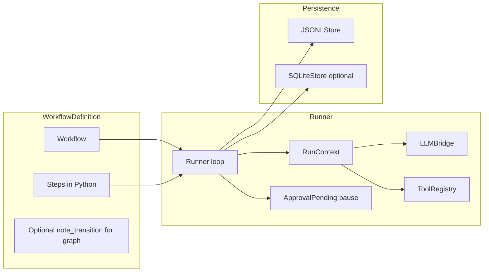
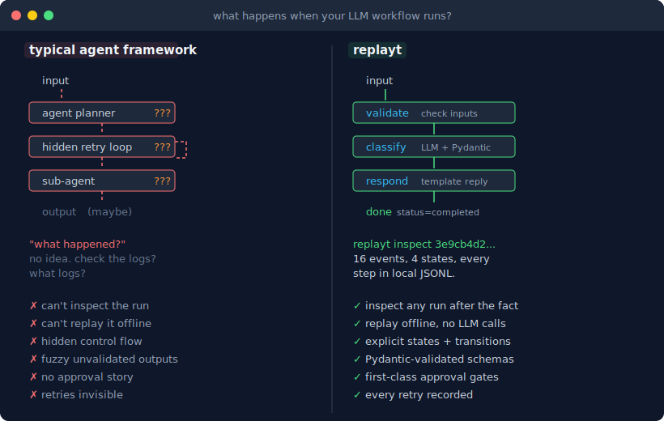

# replayt

**replayt** is a small Python library for **deterministic LLM workflows with local logs and offline replay**.

*PyPI status: **Beta**. Pin versions in production. Minor API or CLI details may still change between releases.*

<p align="center">
  
</p>

## The problem

Most LLM workflows:

- branch **implicitly**
- **fail silently**
- **cannot be replayed**
- are **impossible to debug** after the fact

## replayt

replayt keeps each step explicit, logs the run, and lets you replay it later.

### At a glance

- Define **states** in code (or a small YAML subset); each handler **returns the next state**.
- Each run appends **typed events** to local **JSONL** (optional **SQLite** mirror).
- **LLM** work uses **Pydantic-validated** outputs when you call `ctx.llm`, and those land in the log as structured events.
- **`replayt replay`** and **`replayt report`** walk the recorded timeline **without** calling the provider again (not bitwise regeneration; see [docs/SCOPE.md](docs/SCOPE.md)).
- **Approvals** pause with exit code **`2`**; **`replayt resume`** continues the same run.

The **CLI** follows the same model: `run`, `inspect`, **`replay`**, `report`, `resume`.

### LangGraph and similar frameworks

[LangGraph](https://github.com/langchain-ai/langgraph) targets long-running agent systems.

**replayt** keeps the workflow graph explicit:

- **no** bundled agents
- **no** planners
- **no** hidden loops
- explicit workflows you can **replay**

For plain Python, Temporal, hosted stacks, and migration notes, see [docs/COMPARISON.md](docs/COMPARISON.md).

### Where it fits

| Topic | **Plain Python** (`if` / `else`, ad hoc logging) | **Agent / planner stacks** | **replayt** |
| --- | --- | --- | --- |
| **Control flow** | Fully explicit, but you reinvent structure each time | Often implicit or planner-driven | **Explicit** states and transitions in code |
| **Audit trail** | Whatever you print | Often uneven | **Append-only JSONL** (and optional SQLite) with a stable event schema |
| **Human gates** | Custom | Often bolted on | **First-class** pause / resume with exit code `2` |
| **Tradeoff** | No conventions | Harder to answer "what happened?" | You model a **finite run**. Handle distributed orchestration outside replayt. |

replayt fits best when you want explicit states, validated outputs, and a recorded timeline you can inspect later.

Transitions and branching are **your code**; the model does not silently rewrite the graph. Structured outputs are **validated** (Pydantic) and **logged**. **Timeline replay** (`replayt replay`, `replayt report`) walks the recorded history without calling the provider again; see [docs/SCOPE.md](docs/SCOPE.md).

**Start here:** [Five-minute quickstart](docs/QUICKSTART.md), [Tutorial (14 workflows)](src/replayt_examples/README.md), [Production checklist](docs/PRODUCTION.md), [Recipes (LLM, CI)](docs/RECIPES.md), [Composition patterns](docs/EXAMPLES_PATTERNS.md), and [Vs other tools](docs/COMPARISON.md)

**After quickstart:** in the tutorial, try **section 10, GitHub issue triage** (validation + LLM) and **section 12, Publishing preflight** (structured review + approval) in [`src/replayt_examples/README.md`](src/replayt_examples/README.md).

**Terminal demo:** Short demo cast [`docs/replayt-demo.cast`](docs/replayt-demo.cast) (`asciinema play docs/replayt-demo.cast`). To share it in a browser, upload the cast to [asciinema.org](https://asciinema.org/) and link the player URL here or in your fork. The steps are in [docs/DEMO.md](docs/DEMO.md).

**Once installed:**

```bash
replayt run replayt_examples.e01_hello_world:wf --inputs-json '{"customer_name":"Sam"}'
# same input, less shell quoting:
replayt run replayt_examples.e01_hello_world:wf --input customer_name=Sam
# or: replayt try
replayt inspect <run_id>
replayt replay <run_id>
# step through every decision the workflow recorded (offline; no new LLM calls)
```

replayt is a small workflow runner with:

- states are explicit
- transitions are explicit
- structured outputs are schema-validated
- tool calls are typed and logged
- approval gates are first-class
- run history is stored locally
- past runs can be **inspected and replayed** step by step

The run log should tell you what happened, why the workflow branched, and how to replay it.

### Architecture (the replay log drives the design)

Source: [`docs/architecture.mmd`](docs/architecture.mmd) (open in GitHub or any Mermaid viewer).



---

## Why replayt exists

replayt is for teams that need explicit branches, schema-shaped outputs, and a recorded run they can diff, approve against, and replay later.

<p align="center">
  
</p>

The design is simple: explicit workflows, strict validation, local logs, and replay from the recorded timeline.

---

## What replayt is

replayt is a **finite-state-machine-first runtime for LLM workflows**. The run log is part of the product.

A workflow can include:

- explicit named states
- explicit transitions
- strict Pydantic outputs
- typed tool invocations
- deterministic branching rules
- retry and failure policies
- optional human approval checkpoints
- local JSONL and/or SQLite logs
- replayable execution history
- Mermaid graph export
- a CLI for running, inspecting, resuming, replaying, and listing runs

A replayt workflow should answer:

- What state did the workflow enter?
- What did the model return?
- Which schema validated it?
- Which tool was called?
- Why did it branch this way?
- Where did it fail?
- What required human approval?
- Can I replay the run and inspect it step by step?

---

## What replayt is not

replayt keeps a narrow scope.

It is **not**:

- a general-purpose agent framework
- a multi-agent runtime
- a visual workflow builder
- a hosted observability platform
- a no-code automation tool
- a memory or RAG framework
- an eval suite
- a business process engine for everything
- an "AI workforce" platform
- "Temporal for agents"

---

## Security and trust boundaries

replayt targets **trusted local or CI environments**: running a workflow **runs Python** from your file or import path (`replayt run workflow.py` / `module:wf`), with the privileges of your user.

- **Logs and approvals** are stored on disk without authentication. Anyone who can write your log directory can append events or influence resume behavior. Treat the log path like credential storage. If you must keep some structured fields while scrubbing others, use **`--redact-key FIELD`** (or project config **`redact_keys = [...]`**) to blank matching keys from logged payloads. For pipelines that must not persist raw LLM bodies, set **`forbid_log_mode_full = true`** or export **`REPLAYT_FORBID_LOG_MODE_FULL=1`** so **`replayt run`** / **`ci`** / **`try`** / **`resume`** reject **`log_mode=full`** (see [`docs/CONFIG.md`](docs/CONFIG.md)).
- **`replayt doctor`** performs an HTTP `GET` to ``OPENAI_BASE_URL``/``models`` and may send ``OPENAI_API_KEY``. Point the base URL only at providers you trust, or run ``replayt doctor --skip-connectivity`` to skip network I/O entirely. `doctor` also warns about risky trust-boundary defaults such as remote plain-HTTP base URLs, embedded credentials in `OPENAI_BASE_URL`, or `log_mode=full`. On POSIX hosts it also flags log directories and nearby **`.env`** files that are group- or world-readable/writable (paths and mode bits only; contents are not read). When a default or explicit-on-preflight **inputs JSON** path resolves to an existing file, `doctor` applies the same POSIX permission hints (**`trust_inputs_file_*`**), including **`--inputs-file`** on preflight. With **`--target`**, `doctor` adds the same style of soft checks for the resolved **workflow entry file** (the `.py` / YAML path you pass, or the imported module's **`__file__`** for `MODULE:VAR` targets). When **`run_hook`**, **`resume_hook`**, **`export_hook`**, **`seal_hook`**, or **`verify_seal_hook`** resolves to on-disk script paths (direct paths or `python … script.py` / `bash … script.sh` shapes), `doctor` and **`replayt config --format json`** add **`trust_policy_hook_script_*`** POSIX permission hints the same way, so shared groups or world-writable hook files surface before a gate runs. **`replayt config --format json`** includes workflow entry checks when a default target is configured (**`REPLAYT_TARGET`** or **`[tool.replayt] target`**) and **`trust_inputs_file_*`** when **`run.default_inputs_file`** points at an on-disk file (not stdin). **`replayt doctor --format json`** and **`replayt config --format json`** include **`credential_env`**: a fixed list of common LLM-related environment variable names with boolean **`present`** flags only (no secret values), so reviewers can spot credential scope creep in the shell. Those reports also preview env-driven CI artifact sinks (`REPLAYT_JUNIT_XML`, `REPLAYT_SUMMARY_JSON`, `REPLAYT_GITHUB_SUMMARY` / `GITHUB_STEP_SUMMARY`) so a job can catch missing or unwritable output paths before the real run.

---

## Design principles

### 1. Determinism over autonomy
LLM workflows should behave like systems, not personalities. The model may generate outputs, but it should not silently invent control flow.

### 2. Explicit states over hidden loops
The workflow structure should be obvious in code. No hidden planners, implicit retries, or secret sub-agents.

### 3. Strict schemas over fuzzy outputs
Every meaningful model output should validate against a clear schema. Structured output is the default path.

### 4. Typed tool calls over free-form execution
Tool use should be constrained, validated, and logged as part of the run history.

### 5. Replay is part of the product
If you cannot **`replayt replay`** a run from disk, the audit story is incomplete. Logging exists so you can **inspect and replay** the exact recorded path.

### 6. Local-first by default
No account. No hosted dependency. No cloud requirement in v1.

### 7. Small mental model
A new user should be able to understand the architecture quickly.

---

## Features

### Workflow engine

- Python-first workflow definitions with explicit state handlers (optional `Workflow(..., meta={...})` emitted as `workflow_meta` on `run_started`)
- Optional YAML workflow specs for simple declarative flows
- Per-state retry policies
- Transition declarations and runtime transition validation
- Approval pause/resume support

### LLM layer

- OpenAI-compatible chat provider support
- Strict Pydantic schema parsing for structured outputs
- Explicit `structured_output_failed` events when JSON extraction or schema validation fails (Pydantic failures at `schema_validate` include bounded `validation_issues` with `loc` / `msg` for JSONL triage)
- Redacted, structured-only, or full logging modes
- Per-call LLM overrides via `ctx.llm.with_settings(...)` (logged as `effective` on each `llm_request` / `llm_response`, including `top_p`, OpenAI-style `frequency_penalty` / `presence_penalty`, optional integer `seed` where the provider supports it, optional `stop` sequences (up to four strings) for OpenAI-compatible sampling, per-call `provider` / `base_url`, optional `extra_body={...}` for gateway-specific JSON fields, optional native JSON-schema `response_format`, and optional `experiment={...}` tags you want in the audit trail); each `llm_request` / `llm_response` also carries stable `messages_sha256` / `effective_sha256` fingerprints (plus `schema_sha256` for structured parses), and each `llm_response` records `finish_reason` from the gateway (and optional `chat_completion_id` / `system_fingerprint` when the provider returns them) for truncation and reproducibility checks

### Tooling

- Typed tool registration and invocation
- Tool call and tool result events in run history

### Persistence and replay

- Local JSONL run logs
- Optional SQLite mirroring
- Human-readable replay timeline
- Raw event inspection
- Local run listing

When things go wrong, the run log is the debugging tool:

<p align="center">
  
</p>

### CLI

Command reference: **[docs/CLI.md](docs/CLI.md)**. Everyday flow: `run` -> `inspect` / `replay` / `report` -> optional `resume` after approvals. **`TARGET`** is `module:variable`, `workflow.py`, or `workflow.yaml` / `.yml`.

Extras: **`replayt try --list`** shows curated packaged tutorial workflows, **`replayt try --example issue-triage`** runs one without a local file, and **`--live`** switches from placeholder LLM responses to a real call. For fast local runs, repeat **`--input key=value`** instead of hand-writing a whole JSON blob: dotted keys build nested objects (**`--input issue.title=Crash --input issue.body="Stacktrace..."`**), and those overrides can layer on top of **`--inputs-json`**, **`--inputs-file`**, env/project default inputs files, or packaged-example defaults. **`replayt ci`** matches `run` plus a CI banner, optional **`--junit-xml`**, **`--github-summary`**, **`--summary-json`**, and **`--strict-graph`**. **`replayt run ... --dry-check`** validates the graph and input JSON without executing (**`--inputs-json`**, **`--inputs-file`**, env/project defaults, or repeatable **`--input`**; **`--output json`** / **`validate --format json`** for machine-readable reports). **`replayt validate --strict-graph`** fails when a multi-state workflow declares no transitions. **`replayt contract TARGET`** prints a snapshot-friendly workflow contract, including a stable **`contract_sha256`** fingerprint; **`--snapshot-out`** writes that JSON to a checked-in file, and **`--check PATH`** compares the live workflow against the checked-in snapshot for CI drift checks. **`replayt config --format json`** prints the effective CLI defaults with source provenance, filesystem readiness for the resolved log paths, and any env-driven CI artifact outputs. **`replayt runs --output json`** now carries stakeholder triage fields such as **`attention_summary`**, **`pending_approvals`**, **`latest_failure`**, and **`latest_structured_output_failure`** so PM/support wrappers can spot paused approvals or the last failure without scraping full HTML reports. **`replayt report --style stakeholder`** trims tool/token sections and expands approval context, while **`--style support`** leads with failure and retry context for PM/support handoffs. **`replayt report-diff`** compares two runs in HTML or Markdown (**`--format markdown`** for tickets), including metadata / experiment context and failure signals. **`replayt export-run`** writes a redacted **`.tar.gz`** for sharing, now with a compact `manifest.json` run summary and optional **`--target`** contract snapshot. **`replayt bundle-export`** adds stakeholder **`report.html`**, replay timeline HTML, and sanitized JSONL in one archive, and **`--target`** now embeds both **`workflow.contract.json`** and **`workflow.mmd.txt`** for promotion/audit handoff. **`replayt log-schema`** prints the bundled JSON Schema for one JSONL line. **`replayt seal`** writes a SHA-256 manifest for a JSONL run. **`replayt doctor --format json`** is CI-friendly, can optionally preflight a **`--target`** without running it, and reports path-readiness checks for the effective log / SQLite destinations, configured CI artifacts, soft approval-justification policy warnings, and whether trusted external policy-hook subprocesses are enabled. **`replayt init --ci github`** scaffolds a workflow YAML for Actions, and **`replayt init --template issue-triage|publishing-preflight`** gives you higher-signal starters for common startup workflows. **`replayt resume`** accepts **`--reason`** / **`--actor-json`** / **`--require-actor-key`** / **`--require-reason`** and can run a configured **`resume_hook`** before writing `approval_resolved`. In Python, optional **`Runner(..., before_step=..., after_step=...)`** supports explicit in-process hooks such as notifications or trace IDs without adding a second workflow engine. **`Workflow(..., llm_defaults=...)`**, **`Workflow.contract()`**, and the `run_started.runtime.workflow.contract_sha256` snapshot make defaults and upgrade surfaces explicit; successful CLI policy-hook gates leave compact breadcrumbs in `run_started.runtime`, `approval_resolved`, and export / seal manifests (see [`docs/CONFIG.md`](docs/CONFIG.md) and [`docs/RUN_LOG_SCHEMA.md`](docs/RUN_LOG_SCHEMA.md)).

Project defaults (log dir, provider preset, timeout, and more): **[docs/CONFIG.md](docs/CONFIG.md)**.

---

## Quickstart

### Install

Create a virtual environment, install replayt, then verify with `replayt doctor`:

```bash
python -m venv .venv
source .venv/bin/activate  # POSIX
# .venv\Scripts\activate     # Windows cmd.exe
# .venv\Scripts\Activate.ps1 # Windows PowerShell
pip install replayt
# pip install replayt[yaml]  # if you run .yaml / .yml workflow targets
# pip install -e ".[dev]"     # from a clone: tests, ruff, PyYAML for contributors
export OPENAI_API_KEY=...  # required only for workflows that call a model
replayt doctor
```

Optional dependencies (see [`pyproject.toml`](pyproject.toml)): **`[yaml]`** adds PyYAML for `.yaml` / `.yml` workflow targets; **`[dev]`** adds pytest, ruff, and YAML support for working on the repo.

### Forks and release hygiene

If you maintain a fork or vendor the package, keep **`pyproject.toml`** `[project].version` and **`src/replayt/__init__.py`** `__version__` in lockstep before you tag a release ([`CONTRIBUTING.md`](CONTRIBUTING.md)). From a clone, run **`python scripts/maintainer_checks.py`** (add **`--format json`** for CI parsers and **`--changelog-nonempty`** right before you promote Unreleased into a version) so version consistency, a machine-readable **`[project]`** dependency snapshot (**`python scripts/pyproject_pep621_report.py --format json`** alone when you only need PEP 621 pins), the Unreleased changelog, the PR changelog gate path list (**`python scripts/changelog_gate_policy.py --format json`** when you mirror **`check_changelog_if_needed.py`** in your own CI), docs index links, the packaged **`replayt try`** catalog contract, and the checked-in top-level public API contract are checked together. To check those contracts directly, run **`python scripts/example_catalog_contract.py --check docs/EXAMPLE_CATALOG_CONTRACT.json`** for the tutorial catalog and **`python scripts/public_api_report.py --check docs/PUBLIC_API_CONTRACT.json`** for semver-facing `replayt.__all__` drift. **`python scripts/version_consistency.py`** alone stays the lightest probe after a version edit. Stricter **changelog wording** or **commit-message** rules (Conventional Commits, locale-specific templates, custom regex) belong in **your** `pre-commit` config or CI job: keep using **`python scripts/changelog_unreleased.py --format json`** for a schema-stable Unreleased extract, then apply your policy in a follow-up script. Likewise, a single Typer entry point that runs **`ruff`**, **`pytest`**, and every maintainer script should live in **your** Makefile or pipeline so tool pins and optional extras stay explicit. Pre-commit hooks, SPDX REUSE, and license-header automation stay in **your** repo; replayt does not ship one blessed hook set so downstreams are not forced into a single toolchain. The same boundary applies to GitHub issue or PR templates, **`CODEOWNERS`**, conda-forge recipes, and committed dependency lockfiles: add them beside your governance and CI policy instead of expecting one upstream layout.

**Discover script JSON shapes:** **`replayt version --format json`** lists **`maintainer_script_schemas`** next to **`cli_machine_readable_schemas`** so CI can assert `python scripts/changelog_unreleased.py --format json` (and the other helpers) still emit the schema id your gate expects:

```bash
replayt version --format json | python -c "import json,sys; print(json.load(sys.stdin)['maintainer_script_schemas']['unreleased_changelog'])"
```

**Log schema and typing outside the wheel:** Pin **`docs/RUN_LOG_SCHEMA.md`** from the tag or commit you deploy when you parse JSONL event payloads. **`replayt log-schema`** prints the bundled Draft 2020-12 JSON Schema for a single JSONL line (the envelope: **`ts`**, **`run_id`**, **`seq`**, **`type`**, **`payload`**); per-**`type`** payload shapes stay documented in **`RUN_LOG_SCHEMA.md`**. **`replayt version --format json`** exposes stable ids under **`cli_machine_readable_schemas`** for machine-readable CLI payloads (including **`run`**, **`inspect`**, **`runs`**, **`stats`**, **`diff`**, **`contract`**, **`validate`**, **`doctor`**, **`verify-seal`**, seal/export manifest schemas, and packaged-example helpers) so subprocess and MCP wrappers can validate outputs without scraping prose. The same payload includes **`policy_hook_env_catalog`**, which lists the **`REPLAYT_*`** names injected into each trusted policy hook subprocess (`run_hook`, `resume_hook`, `export_hook`, `seal_hook`, `verify_seal_hook`) together with the matching **`argv_env`** / TOML keys, and notes that hook stdin is **`devnull`**, plus **`cli_stdio_contract`**, which lists when **`run`**, **`ci`**, **`validate`**, and **`doctor`** may read a UTF-8 JSON object from **process stdin** (via **`--inputs-file -`**, **`--inputs-json @-`**, or **`REPLAYT_INPUTS_FILE=-`**) so wrappers default **`subprocess.DEVNULL`** unless they intentionally pipe inputs, and **`cli_json_stdout_contract`**, which maps each JSON-capable subcommand to the **`--output` / `--format` / `--json`** flags that select JSON on stdout and the matching **`cli_machine_readable_schemas`** key (stdout only; not file sinks such as **`--summary-json`**). It also includes sorted **`cli_subcommands`** for the top-level **`replayt`** commands on the installed Typer app (allowlists and doc drift checks without parsing **`--help`**), sorted **`supported_project_config_keys`** for the `[tool.replayt]` / **`.replaytrc.toml`** allowlist when you need drift checks or a generator for your own editor schema, and **`maintainer_script_schemas`** for the JSON reports emitted by repo **`scripts/*.py`** helpers when you gate forks or CI on those tools, plus **`cli_exit_codes`** for the **`replayt run` / `ci` / `resume` / `try`** 0/1/2 contract and JSON-mode exits for **`doctor`** and **`validate`**, and **`operational_paths`** for absolute **`cwd`**, **`effective_log_dir`**, and env-resolved CI sink paths from the current working directory. For static types, generate stubs in your own tree (for example `python -m mypy.stubgen -m replayt -o typings/replayt`) instead of expecting checked-in `.pyi` files inside the published package, where stub drift and mypy-version coupling would become a maintainer bottleneck.

**Logs and PII:** runs write append-only JSONL under `.replayt/runs/` by default. Use **`--log-mode`** or Python **`LogMode.redacted` / `structured_only`** when prompts may contain sensitive text, and layer **`--redact-key FIELD`** (or project config **`redact_keys = [...]`**) when specific structured keys such as `email` or `token` should never land in the log. See [`docs/RUN_LOG_SCHEMA.md`](docs/RUN_LOG_SCHEMA.md) and [`docs/PRODUCTION.md`](docs/PRODUCTION.md).

Shell-specific venv activation, `.env` loading recipes, and troubleshooting: **[docs/INSTALL.md](docs/INSTALL.md)**.

---

### Scaffold a minimal project

```bash
replayt init --path .
replayt doctor --skip-connectivity --target workflow.py
replayt run --dry-check
replayt run
```

`replayt init` now writes `inputs.example.json` plus a local `.replaytrc.toml` that pins `target = "workflow.py"` (or `workflow.yaml`) and `inputs_file = "inputs.example.json"`, so the first run can stay at plain `replayt run`. Its terminal output also prints shell-specific activation lines plus `doctor --skip-connectivity --target workflow.py` before the first run; LLM-backed templates suggest `--dry-run` first so the copy-paste path works before provider setup. For a less-toy starting point, use `replayt init --template issue-triage` or `replayt init --template publishing-preflight`. `replayt run workflow.py` also accepts a Python file that exports exactly one top-level `Workflow` object, even if you did not name it `wf`.

### Run a Python workflow

```bash
replayt run replayt_examples.issue_triage:wf \
  --inputs-json '{"issue":{"title":"Crash on save","body":"Steps: open app, click save, crash. Expected: file writes successfully."}}'
```

### Inspect and replay the run

```bash
replayt inspect <run_id>
replayt inspect <run_id> --output markdown   # short stakeholder blurb for chat / tickets
replayt replay <run_id>
# step through the recorded timeline (same events; no new LLM calls)
replayt report <run_id> --out report.html   # self-contained HTML summary
replayt runs
```

### Export a graph

```bash
replayt graph replayt_examples.issue_triage:wf
```

### Run a workflow from a Python file

```bash
replayt run workflow.py --inputs-json '{"ticket":"hello"}'
```

### Run a workflow from YAML

```bash
replayt run workflow.yaml --inputs-json '{"route":"approve"}'
```

---

**LLM client setup, per-call overrides, and CI snippets** live in **[docs/RECIPES.md](docs/RECIPES.md)** so this page stays shorter.

## A tiny Python example

```python
from pathlib import Path

from replayt import LogMode, Runner, Workflow
from replayt.persistence import JSONLStore

wf = Workflow("demo", version="1")
wf.set_initial("hello")

@wf.step("hello")
def hello(ctx):
    ctx.set("message", "replayt")
    return None

runner = Runner(
    wf,
    JSONLStore(Path(".replayt/runs")),
    log_mode=LogMode.redacted,
)

result = runner.run(inputs={"demo": True})
print(result.run_id, result.status)
```

---

## Structured output example

```python
from pydantic import BaseModel

class Decision(BaseModel):
    action: str
    confidence: float

@wf.step("classify")
def classify(ctx):
    decision = ctx.llm.parse(
        Decision,
        messages=[
            {
                "role": "user",
                "content": "Classify this ticket and return strict JSON.",
            }
        ],
    )
    ctx.set("decision", decision.model_dump())
    return "done"
```

replayt logs the request, response metadata, and validated structured output as explicit run events. On success, `structured_output` repeats the resolved `effective` settings plus `usage`, `latency_ms`, and `finish_reason` (and optional provider ids) from the same completion so JSONL-only pipelines can attribute tokens and model parameters to a `schema_name` without joining the prior `llm_response` line.

When you need stricter per-call control, keep it explicit and local:

```python
@wf.step("classify")
def classify(ctx):
    decision = (
        ctx.llm.with_settings(
            provider="openai",
            base_url="https://gateway.example.com/v1",
            top_p=0.2,
            frequency_penalty=0.0,
            presence_penalty=0.4,
            seed=42,
            extra_body={"reasoning": {"effort": "low"}},
            native_response_format=True,
            experiment={"cohort": "router-a"},
        )
        .parse(Decision, messages=[{"role": "user", "content": "Return strict JSON only."}])
    )
    ctx.set("decision", decision.model_dump())
    return "done"
```

Those per-call overrides show up under `effective` on `llm_request` / `llm_response` / successful `structured_output`, and the bridge also records stable `messages_sha256` / `effective_sha256` fingerprints (plus `schema_sha256` for structured parses) so you can compare prompt, schema, and settings changes even when logs stay redacted. Failed parses emit `structured_output_failed` with the failure stage (`json_extract`, `json_decode`, `schema_validate`, and similar) so JSONL keeps the debugging trail explicit; when Pydantic rejects the parsed object, the event also carries a bounded `validation_issues` list (field `loc`, message, error `type`) plus `validation_issue_count` and `validation_issues_truncated` when the model returned many simultaneous violations. If your gateway needs an extra JSON knob that replayt does not model directly, pass a small `extra_body={...}` dict and keep the setting in the run log instead of hiding it in an app-local wrapper.

### Retries, tool calls, and provider-only APIs

replayt does not add hidden repair loops around `ctx.llm.parse` or bundle first-class OpenAI `tools` / `tool_choice` on `LLMBridge`. When a parse fails, catch the exception (or inspect `structured_output_failed` in JSONL), adjust messages or settings, and call again from your step so every attempt stays an explicit transition in your code. For native tool routing, streaming, or vision, call the vendor SDK inside one `@wf.step` and return one validated Pydantic-shaped outcome before transitioning; see **Pattern: OpenAI Python SDK inside a step** in [`docs/EXAMPLES_PATTERNS.md`](docs/EXAMPLES_PATTERNS.md).

```python
# Explicit re-try in application code (not inside the bridge).
for attempt in range(2):
    try:
        decision = ctx.llm.parse(Decision, messages=msgs)
        break
    except Exception:
        if attempt == 1:
            raise
        msgs = msgs + [{"role": "user", "content": "Return only one JSON object, no prose."}]
```

## Documentation map

- [Five-minute quickstart](docs/QUICKSTART.md): install, first run, replay semantics, failed-run inspect, and a minimal LLM step
- [Install & troubleshooting](docs/INSTALL.md): shells, `.env`, and common errors
- [Production checklist](docs/PRODUCTION.md): logs, approvals, CI, and the process model
- [Recipes](docs/RECIPES.md): LLM client config, CI exit codes, and mocks
- [CLI reference](docs/CLI.md): all commands
- [Project config](docs/CONFIG.md): `.replaytrc.toml` and `[tool.replayt]`
- [Comparison / migration](docs/COMPARISON.md): plain Python, agent frameworks, Temporal, and hosted stacks
- [Composition patterns](docs/EXAMPLES_PATTERNS.md): queues, bridges, tests, and SDK-in-one-step patterns
- [Scope / non-goals](docs/SCOPE.md): maintainer contract for core boundaries
- [Run log schema](docs/RUN_LOG_SCHEMA.md): JSONL event types
- [Docs index](docs/README.md): full list including demos and architecture
- [Architecture (Mermaid source)](docs/architecture.mmd)
- [Tutorial](src/replayt_examples/README.md): 14 runnable workflows in order (`replayt_examples.*` on PyPI)

---

## Typed tool example

```python
from pydantic import BaseModel

class AddInput(BaseModel):
    a: int
    b: int

class AddOutput(BaseModel):
    total: int

@wf.step("compute")
def compute(ctx):
    @ctx.tools.register
    def add(payload: AddInput) -> AddOutput:
        return AddOutput(total=payload.a + payload.b)

    result = ctx.tools.call("add", {"payload": {"a": 2, "b": 3}})
    ctx.set("sum", result.total)
    return None
```

---

## Approval gate example

<p align="center">
  
</p>

```python
@wf.step("review")
def review(ctx):
    if ctx.is_approved("publish"):
        return "done"
    if ctx.is_rejected("publish"):
        return "abort"
    ctx.request_approval("publish", summary="Publish this draft?")
```

Run it, then resume it later from the CLI:

```bash
replayt run replayt_examples.publishing_preflight:wf \
  --inputs-json '{"draft":"A draft that may need review."}'

replayt resume replayt_examples.publishing_preflight:wf <run_id> --approval publish
```

---

## YAML workflow example

The YAML mode is intentionally small. It is useful for straightforward deterministic flows, not for replacing Python as the primary authoring surface.

```yaml
name: refund-routing
version: 1
initial: ingest
steps:
  ingest:
    require: [ticket, route]
    set:
      stage: ingested
    next: branch

  branch:
    branch:
      key: route
      cases:
        refund: refund
        deny: deny
      default: deny

  refund:
    set:
      decision: refund

  deny:
    set:
      decision: deny
```

---

## Example workflows included

The repo ships a **linear tutorial** of **14 runnable workflows** covering deterministic steps, LLM-backed classification, tools, retries, approvals, YAML, and OpenAI/Anthropic SDK patterns. See [`src/replayt_examples/README.md`](src/replayt_examples/README.md). **Composition patterns** such as queues, approval UIs, and pytest live in [`docs/EXAMPLES_PATTERNS.md`](docs/EXAMPLES_PATTERNS.md).

**Tutorial examples:**

- **GitHub issue triage:** validate issue shape, classify it, then route or request more information
- **Refund policy:** constrained support decisions with structured model output
- **Publishing preflight:** checklist plus a pause for approval, then finalize or abort

---

## Log model

Run events are append-only and local-first. A typical run log captures:

- workflow name and version
- run ID
- timestamps and event sequence numbers
- state entry and exit
- transition decisions
- LLM requests and responses
- validated structured outputs
- tool calls and results
- retries and failures
- approval requests and resolutions
- final status

See [`docs/RUN_LOG_SCHEMA.md`](docs/RUN_LOG_SCHEMA.md) for the event schema, [`docs/README.md`](docs/README.md) for the consolidated docs index, and [`src/replayt_examples/README.md`](src/replayt_examples/README.md) for the runnable workflow guide.

---

## When to use replayt

Use replayt when you want explicit workflow states, strict schema validation around model outputs, local run history and timeline replay, and first-class approval gates.

Choose another tool when you want autonomous long-running agents, a distributed workflow engine with cross-process durability, or a visual graph builder.

The scope boundaries are in [docs/SCOPE.md](docs/SCOPE.md).

Treat **JSONL and SQLite files you own** as the source of truth for dashboards and approval UIs. replayt is the **engine**; your app owns auth, routing, and UX.

**Operations:** run one finite workflow per process or queue message. Let the scheduler handle retries. See **[docs/PRODUCTION.md](docs/PRODUCTION.md)** and **Pattern: queue worker** in [`docs/EXAMPLES_PATTERNS.md`](docs/EXAMPLES_PATTERNS.md).

---

## Requests we will not take in core (and what to do instead)

The full table of common asks, rationale, and **composition patterns** (approval bridge, batch driver, golden tests, and more) lives in **[docs/SCOPE.md](docs/SCOPE.md)**.

#### Policy hooks, eval-style harnesses, and agent frameworks

Teams often want SSO-gated approvals, org policy checks before `resume`, pytest-driven regression loops, or planner-style frameworks inside "the workflow." Those belong in **your** process wrapper or app layer. replayt stays a **Runner** with explicit states and local JSONL, not a hosted control plane, RBAC product, or bundled eval suite ([docs/SCOPE.md](docs/SCOPE.md)).

- **Approvals + identity:** read paused runs from JSONL/SQLite and resolve gates from a UI or chatbot. See **Pattern: approval bridge (local UI)** in [`docs/EXAMPLES_PATTERNS.md`](docs/EXAMPLES_PATTERNS.md). For notifications and policy logging without a second engine, use **Pattern: webhook / lifecycle callbacks** or `Runner(..., before_step=..., after_step=...)`.
- **CLI policy subprocesses:** optional **`run_hook`**, **`resume_hook`**, **`export_hook`**, **`seal_hook`**, and **`verify_seal_hook`** (plus env overrides) run trusted argv before new events, tarball export, standalone seal manifests, or after a successful **`replayt verify-seal`** digest check; see [`docs/CONFIG.md`](docs/CONFIG.md). **`run_hook`** also receives normalized JSON strings for the resolved inputs, tags, run metadata, and experiment payload so a wrapper can enforce change-ticket or environment policy before the run starts, plus **`REPLAYT_WORKFLOW_CONTRACT_SHA256`**, **`REPLAYT_WORKFLOW_NAME`**, and **`REPLAYT_WORKFLOW_VERSION`** from the loaded workflow's **`Workflow.contract()`** snapshot (the same digest recorded on **`run_started`**). **`resume_hook`**, **`export_hook`**, **`seal_hook`**, and **`verify_seal_hook`** receive the same three workflow env vars and, when the run log's first **`run_started`** records them, the same **`REPLAYT_RUN_METADATA_JSON`**, **`REPLAYT_RUN_TAGS_JSON`**, and **`REPLAYT_RUN_EXPERIMENT_JSON`** strings as **`run_hook`** (so promotion labels and experiment tags are visible to resume and archival gates without re-parsing JSONL). **`export_hook`** also gets **`REPLAYT_TARGET`** when you pass **`--target`** on **`export-run`** / **`bundle-export`**. Successful gates leave compact breadcrumbs in `run_started.runtime.policy_hooks`, `approval_resolved.policy_hook`, or the export / seal manifest so replay stays explicit about where external code was involved. Verify OIDC/JWT or SAML in **your** bridge or wrapper, then call **`replayt resume`** / **`replayt seal`** with credentials replayt never sees.
- **Harness-style runs:** call `Runner.run` from pytest with frozen inputs and assert on final context or events. See **Pattern: golden path test (pytest)**. For many jobs, use an outer loop such as **Pattern: batch driver (Airflow / Celery / plain loop)**.
- **Streaming or LangChain-style graphs:** keep provider SDKs and planners **inside one step**, then transition on one Pydantic-shaped outcome. See **Pattern: stream inside step, log structured summary** and **Pattern: framework in a sandbox step**.

Human-readable timeline export without building a server:

```bash
replayt replay <run_id> --format html --out run.html
```

#### Streaming, planner loops, and "agents" (composition, not core)

Core does **not** emit per-token events or embed LangGraph-style planners in the `Runner`. That would flood JSONL and hide control flow. Put streaming, tool loops, and third-party graphs **inside a single `@wf.step`**, then return one explicit next state after a Pydantic-validated result (or log a summary yourself). For a worked example, see **LangGraph (and similar frameworks) - composition, not core** in [`src/replayt_examples/README.md`](src/replayt_examples/README.md). Related patterns live in [`docs/EXAMPLES_PATTERNS.md`](docs/EXAMPLES_PATTERNS.md).

---

## Development

```bash
python -m build
pytest
ruff check src tests
```

A minimal CI job mirrors that: install with `pip install -e ".[dev]"`, run `pytest`, then `ruff check src tests`.

See [`CONTRIBUTING.md`](CONTRIBUTING.md) for the rest.

---

## License

Apache-2.0. See [`LICENSE`](LICENSE).
