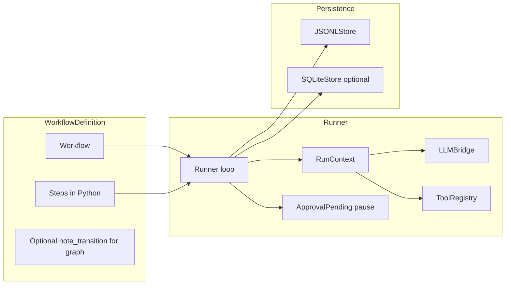

# replayt

**replayt** is a small Python library for **deterministic LLM workflows with local logs and offline replay**.

*PyPI status: **Beta**. Pin versions in production. Minor API or CLI details may still change between releases.*

<p align="center">
  
</p>

## The problem

Most LLM workflows:

- branch **implicitly**
- **fail silently**
- **cannot be replayed**
- are **impossible to debug** after the fact

## replayt

replayt keeps each step explicit, logs the run, and lets you replay it later.

### In five seconds

- Define **states** in code (or a small YAML subset); each handler **returns the next state**.
- Each run appends **typed events** to local **JSONL** (optional **SQLite** mirror).
- **LLM** work uses **Pydantic-validated** outputs when you call `ctx.llm`, and those land in the log as structured events.
- **`replayt replay`** and **`replayt report`** walk the recorded timeline **without** calling the provider again (not bitwise regeneration; see [docs/SCOPE.md](docs/SCOPE.md)).
- **Approvals** pause with exit code **`2`**; **`replayt resume`** continues the same run.

The **CLI** follows the same model: `run`, `inspect`, **`replay`**, `report`, `resume`.

### LangGraph and similar frameworks

[LangGraph](https://github.com/langchain-ai/langgraph) is powerful, but built for long-running agent systems.

**replayt** keeps the workflow graph explicit:

- **no** bundled agents
- **no** planners
- **no** hidden loops
- explicit workflows you can **replay**

For plain Python, Temporal, hosted stacks, and migration notes, see [docs/COMPARISON.md](docs/COMPARISON.md).

### Where it fits

| Topic | **Plain Python** (`if` / `else`, ad hoc logging) | **Agent / planner stacks** | **replayt** |
| --- | --- | --- | --- |
| **Control flow** | Fully explicit, but you reinvent structure each time | Often implicit or planner-driven | **Explicit** states and transitions in code |
| **Audit trail** | Whatever you print | Often uneven | **Append-only JSONL** (and optional SQLite) with a stable event schema |
| **Human gates** | Custom | Often bolted on | **First-class** pause / resume with exit code `2` |
| **Tradeoff** | No conventions | Harder to answer “what happened?” | You model a **finite run**. Handle distributed orchestration outside replayt. |

replayt fits best when you want explicit states, validated outputs, and a recorded timeline you can inspect later.

Transitions and branching are **your code**; the model does not silently rewrite the graph. Structured outputs are **validated** (Pydantic) and **logged**. **Timeline replay** (`replayt replay`, `replayt report`) walks the recorded history without calling the provider again; see [docs/SCOPE.md](docs/SCOPE.md).

**Start here:** [Five-minute quickstart](docs/QUICKSTART.md) · [Tutorial (14 workflows)](src/replayt_examples/README.md) · [Production checklist](docs/PRODUCTION.md) · [Recipes (LLM, CI)](docs/RECIPES.md) · [Composition patterns](docs/EXAMPLES_PATTERNS.md) · [Vs other tools](docs/COMPARISON.md)

**After quickstart:** in the tutorial, try **§10 GitHub issue triage** (validation + LLM) and **§12 Publishing preflight** (structured review + approval) in [`src/replayt_examples/README.md`](src/replayt_examples/README.md).

**Terminal demo:** Short illustrative cast [`docs/replayt-demo.cast`](docs/replayt-demo.cast) (`asciinema play docs/replayt-demo.cast`). To share it in a browser, upload the cast to [asciinema.org](https://asciinema.org/) and link the player URL here or in your fork. The steps are in [docs/DEMO.md](docs/DEMO.md).

**Core loop** once installed:

```bash
replayt run replayt_examples.e01_hello_world:wf --inputs-json '{"customer_name":"Sam"}'
# or: replayt try
replayt inspect <run_id>
replayt replay <run_id>
# step through every decision the workflow recorded (offline; no new LLM calls)
```

That is the main loop. The log exists so you can inspect and replay the recorded run.

replayt gives you a small, strict workflow runner where:

- states are explicit
- transitions are explicit
- structured outputs are schema-validated
- tool calls are typed and logged
- approval gates are first-class
- run history is stored locally
- past runs can be **inspected and replayed** step by step

The run log should tell you what happened, why the workflow branched, and how to replay it.

### Architecture (one glance; everything serves the replay log)

Source: [`docs/architecture.mmd`](docs/architecture.mmd) (open in GitHub or any Mermaid viewer).



---

## Why replayt exists

replayt is for teams that need explicit branches, schema-shaped outputs, and a recorded run they can diff, approve against, and replay later.

<p align="center">
  
</p>

The core rules are simple: explicit workflow, strict validation, local logs, and replay of the recorded timeline.

---

## What replayt is

replayt is a **finite-state-machine-first runtime for LLM workflows**. The run log is a first-class output, not an afterthought.

A workflow can include:

- explicit named states
- explicit transitions
- strict Pydantic outputs
- typed tool invocations
- deterministic branching rules
- retry and failure policies
- optional human approval checkpoints
- local JSONL and/or SQLite logs
- replayable execution history
- Mermaid graph export
- a CLI for running, inspecting, resuming, replaying, and listing runs

A replayt workflow should answer:

- What state did the workflow enter?
- What did the model return?
- Which schema validated it?
- Which tool was called?
- Why did it branch this way?
- Where did it fail?
- What required human approval?
- Can I replay the run and inspect it step by step?

That is what the run log is for.

---

## What replayt is not

replayt keeps a narrow scope.

It is **not**:

- a general-purpose agent framework
- a multi-agent runtime
- a visual workflow builder
- a hosted observability platform
- a no-code automation tool
- a memory or RAG framework
- an eval suite
- a business process engine for everything
- an “AI workforce” platform
- “Temporal for agents”

The goal is a small tool you can understand quickly.

---

## Security and trust boundaries

replayt targets **trusted local or CI environments**: running a workflow **runs Python** from your file or import path (`replayt run workflow.py` / `module:wf`), with the privileges of your user.

- **Logs and approvals** are stored on disk without authentication. Anyone who can write your log directory can append events or influence resume behavior. Treat the log path like credential storage.
- **`replayt doctor`** performs an HTTP `GET` to ``OPENAI_BASE_URL``/``models`` and may send ``OPENAI_API_KEY``. Point the base URL only at providers you trust, or run ``replayt doctor --skip-connectivity`` to skip network I/O entirely.

---

## Design principles

### 1. Determinism over autonomy
LLM workflows should behave like systems, not personalities. The model may generate outputs, but it should not silently invent control flow.

### 2. Explicit states over hidden loops
The workflow structure should be obvious in code. No hidden planners, implicit retries, or secret sub-agents.

### 3. Strict schemas over fuzzy outputs
Every meaningful model output should validate against a clear schema. Structured output is the default path, not a nice-to-have.

### 4. Typed tool calls over free-form execution
Tool use should be constrained, validated, and logged as part of the run history.

### 5. Replay is part of the product
If you cannot **`replayt replay`** a run from disk, the audit story is incomplete. Logging exists so you can **inspect and replay** the exact recorded path.

### 6. Local-first by default
No account. No hosted dependency. No cloud requirement in v1.

### 7. Tiny mental model
A new user should be able to understand the architecture quickly.

---

## Current feature set

### Workflow engine

- Python-first workflow definitions with explicit state handlers (optional `Workflow(..., meta={...})` emitted as `workflow_meta` on `run_started`)
- Optional YAML workflow specs for simple declarative flows
- Per-state retry policies
- Transition declarations and runtime transition validation
- Approval pause/resume support

### LLM layer

- OpenAI-compatible chat provider support
- Strict Pydantic schema parsing for structured outputs
- Redacted, structured-only, or full logging modes
- Per-call LLM overrides via `ctx.llm.with_settings(...)` (logged as `effective` on each `llm_request` / `llm_response`, including optional `experiment={...}` for tags you want in the audit trail)

### Tooling

- Typed tool registration and invocation
- Tool call and tool result events in run history

### Persistence and replay

- Local JSONL run logs
- Optional SQLite mirroring
- Human-readable replay timeline
- Raw event inspection
- Local run listing

When things go wrong, the run log is the debugging tool:

<p align="center">
  
</p>

### CLI

Command reference: **[docs/CLI.md](docs/CLI.md)**. Everyday flow: `run` → `inspect` / `replay` / `report` → optional `resume` after approvals. **`TARGET`** is `module:variable`, `workflow.py`, or `workflow.yaml` / `.yml`.

Extras: **`replayt try`** runs the packaged hello-world tutorial (offline placeholder LLM by default; **`--live`** for a real call). **`replayt ci`** matches `run` plus a CI banner, optional **`--junit-xml`**, **`--github-summary`**, and **`--strict-graph`**. **`replayt run ... --dry-check`** validates the graph and input JSON without executing (**`--inputs-json`** or **`--inputs-file`**; **`--output json`** / **`validate --format json`** for machine-readable reports). **`replayt validate --strict-graph`** fails when a multi-state workflow declares no transitions. **`replayt report --style stakeholder`** trims tool/token sections and expands approval context. **`replayt report-diff`** compares two runs in HTML. **`replayt export-run`** writes a redacted **`.tar.gz`** for sharing, and **`replayt bundle-export`** adds stakeholder **`report.html`**, replay timeline HTML, and sanitized JSONL in one archive. **`replayt log-schema`** prints the bundled JSON Schema for one JSONL line. **`replayt seal`** writes a SHA-256 manifest for a JSONL run. **`replayt doctor --format json`** is CI-friendly, and **`replayt init --ci github`** scaffolds a workflow YAML for Actions. **`replayt resume`** accepts **`--reason`** / **`--actor-json`** and can run a configured **`resume_hook`** before writing `approval_resolved`. In Python, optional **`Runner(..., before_step=..., after_step=...)`** supports explicit in-process hooks such as notifications or trace IDs without adding a second workflow engine. **`Workflow(..., llm_defaults=...)`** or **`meta["llm_defaults"]`** merge into logged LLM **`effective`** (see [`docs/CONFIG.md`](docs/CONFIG.md)).

Project defaults (log dir, provider preset, timeout, and more): **[docs/CONFIG.md](docs/CONFIG.md)**.

---

## Quickstart

### Install

Create a virtual environment, install replayt, then verify with `replayt doctor`:

```bash
python -m venv .venv
source .venv/bin/activate  # POSIX
# .venv\Scripts\activate     # Windows cmd.exe
# .venv\Scripts\Activate.ps1 # Windows PowerShell
pip install replayt
# pip install replayt[yaml]  # if you run .yaml / .yml workflow targets
# pip install -e ".[dev]"     # from a clone: tests, ruff, PyYAML for contributors
export OPENAI_API_KEY=...  # required only for workflows that call a model
replayt doctor
```

Optional dependencies (see [`pyproject.toml`](pyproject.toml)): **`[yaml]`** adds PyYAML for `.yaml` / `.yml` workflow targets; **`[dev]`** adds pytest, ruff, and YAML support for working on the repo.

**Logs and PII:** runs write append-only JSONL under `.replayt/runs/` by default. Use **`--log-mode`** or Python **`LogMode.redacted` / `structured_only`** when prompts may contain sensitive text. See [`docs/RUN_LOG_SCHEMA.md`](docs/RUN_LOG_SCHEMA.md) and [`docs/PRODUCTION.md`](docs/PRODUCTION.md).

Shell-specific venv activation, `.env` loading recipes, and troubleshooting: **[docs/INSTALL.md](docs/INSTALL.md)**.

---

### Scaffold a minimal project

```bash
replayt init --path .
replayt run workflow.py --inputs-json '{}'
```

### Run a Python workflow

```bash
replayt run replayt_examples.issue_triage:wf \
  --inputs-json '{"issue":{"title":"Crash on save","body":"Steps: open app, click save, crash. Expected: file writes successfully."}}'
```

### Inspect and replay the run

```bash
replayt inspect <run_id>
replayt replay <run_id>
# step through the recorded timeline (same events; no new LLM calls)
replayt report <run_id> --out report.html   # self-contained HTML summary
replayt runs
```

### Export a graph

```bash
replayt graph replayt_examples.issue_triage:wf
```

### Run a workflow from a Python file

```bash
replayt run workflow.py --inputs-json '{"ticket":"hello"}'
```

### Run a workflow from YAML

```bash
replayt run workflow.yaml --inputs-json '{"route":"approve"}'
```

---

**LLM client setup, per-call overrides, and CI snippets** live in **[docs/RECIPES.md](docs/RECIPES.md)** so this page stays shorter.

## A tiny Python example

```python
from pathlib import Path

from replayt import LogMode, Runner, Workflow
from replayt.persistence import JSONLStore

wf = Workflow("demo", version="1")
wf.set_initial("hello")

@wf.step("hello")
def hello(ctx):
    ctx.set("message", "replayt")
    return None

runner = Runner(
    wf,
    JSONLStore(Path(".replayt/runs")),
    log_mode=LogMode.redacted,
)

result = runner.run(inputs={"demo": True})
print(result.run_id, result.status)
```

---

## Structured output example

```python
from pydantic import BaseModel

class Decision(BaseModel):
    action: str
    confidence: float

@wf.step("classify")
def classify(ctx):
    decision = ctx.llm.parse(
        Decision,
        messages=[
            {
                "role": "user",
                "content": "Classify this ticket and return strict JSON.",
            }
        ],
    )
    ctx.set("decision", decision.model_dump())
    return "done"
```

replayt logs the request, response metadata, and validated structured output as explicit run events.

## Documentation map

- [Five-minute quickstart](docs/QUICKSTART.md): install, first run, replay semantics, failed-run inspect, and a minimal LLM step
- [Install & troubleshooting](docs/INSTALL.md): shells, `.env`, and common errors
- [Production checklist](docs/PRODUCTION.md): logs, approvals, CI, and the process model
- [Recipes](docs/RECIPES.md): LLM client config, CI exit codes, and mocks
- [CLI reference](docs/CLI.md): all commands
- [Project config](docs/CONFIG.md): `.replaytrc.toml` and `[tool.replayt]`
- [Comparison / migration](docs/COMPARISON.md): plain Python, agent frameworks, Temporal, and hosted stacks
- [Composition patterns](docs/EXAMPLES_PATTERNS.md): queues, bridges, tests, and SDK-in-one-step patterns
- [Scope / non-goals](docs/SCOPE.md): maintainer contract for core boundaries
- [Run log schema](docs/RUN_LOG_SCHEMA.md): JSONL event types
- [Docs index](docs/README.md): full list including demos and architecture
- [Architecture (Mermaid source)](docs/architecture.mmd)
- [Tutorial](src/replayt_examples/README.md): 14 runnable workflows in order (`replayt_examples.*` on PyPI)

---

## Typed tool example

```python
from pydantic import BaseModel

class AddInput(BaseModel):
    a: int
    b: int

class AddOutput(BaseModel):
    total: int

@wf.step("compute")
def compute(ctx):
    @ctx.tools.register
    def add(payload: AddInput) -> AddOutput:
        return AddOutput(total=payload.a + payload.b)

    result = ctx.tools.call("add", {"payload": {"a": 2, "b": 3}})
    ctx.set("sum", result.total)
    return None
```

---

## Approval gate example

<p align="center">
  
</p>

```python
@wf.step("review")
def review(ctx):
    if ctx.is_approved("publish"):
        return "done"
    if ctx.is_rejected("publish"):
        return "abort"
    ctx.request_approval("publish", summary="Publish this draft?")
```

Run it, then resume it later from the CLI:

```bash
replayt run replayt_examples.publishing_preflight:wf \
  --inputs-json '{"draft":"A draft that may need review."}'

replayt resume replayt_examples.publishing_preflight:wf <run_id> --approval publish
```

---

## YAML workflow example

The YAML mode is intentionally small. It is useful for straightforward deterministic flows, not for replacing Python as the primary authoring surface.

```yaml
name: refund-routing
version: 1
initial: ingest
steps:
  ingest:
    require: [ticket, route]
    set:
      stage: ingested
    next: branch

  branch:
    branch:
      key: route
      cases:
        refund: refund
        deny: deny
      default: deny

  refund:
    set:
      decision: refund

  deny:
    set:
      decision: deny
```

---

## Example workflows included

The repo ships a **linear tutorial** of **14 runnable workflows** covering deterministic steps, LLM-backed classification, tools, retries, approvals, YAML, and OpenAI/Anthropic SDK patterns. See [`src/replayt_examples/README.md`](src/replayt_examples/README.md). **Composition patterns** such as queues, approval UIs, and pytest live in [`docs/EXAMPLES_PATTERNS.md`](docs/EXAMPLES_PATTERNS.md).

**Tutorial highlights:**

- **GitHub issue triage:** validate issue shape, classify it, then route or request more information
- **Refund policy:** constrained support decisions with structured model output
- **Publishing preflight:** checklist plus a pause for approval, then finalize or abort

---

## Log model

Run events are append-only and local-first. A typical run log captures:

- workflow name and version
- run ID
- timestamps and event sequence numbers
- state entry and exit
- transition decisions
- LLM requests and responses
- validated structured outputs
- tool calls and results
- retries and failures
- approval requests and resolutions
- final status

See [`docs/RUN_LOG_SCHEMA.md`](docs/RUN_LOG_SCHEMA.md) for the event schema, [`docs/README.md`](docs/README.md) for the consolidated docs index, and [`src/replayt_examples/README.md`](src/replayt_examples/README.md) for the runnable workflow guide.

---

## When to use replayt

Use replayt when you want explicit workflow states, strict schema validation around model outputs, local run history and timeline replay, and first-class approval gates.

Choose another tool when you want autonomous long-running agents, a distributed workflow engine with cross-process durability, or a visual graph builder.

The scope boundaries are in [docs/SCOPE.md](docs/SCOPE.md).

Treat **JSONL and SQLite files you own** as the source of truth for dashboards and approval UIs. replayt is the **engine**; your app owns auth, routing, and UX.

**Operations:** run one finite workflow per process or queue message. Let the scheduler handle retries. See **[docs/PRODUCTION.md](docs/PRODUCTION.md)** and **Pattern: queue worker** in [`docs/EXAMPLES_PATTERNS.md`](docs/EXAMPLES_PATTERNS.md).

---

## Requests we will not take in core (and what to do instead)

The full table of common asks, rationale, and **composition patterns** (approval bridge, batch driver, golden tests, and more) lives in **[docs/SCOPE.md](docs/SCOPE.md)**.

#### Policy hooks, eval-style harnesses, and agent frameworks

Teams often want SSO-gated approvals, org policy checks before `resume`, pytest-driven regression loops, or planner-style frameworks inside “the workflow.” Those belong in **your** process wrapper or app layer. replayt stays a **Runner** with explicit states and local JSONL, not a hosted control plane, RBAC product, or bundled eval suite ([docs/SCOPE.md](docs/SCOPE.md)).

- **Approvals + identity:** read paused runs from JSONL/SQLite and resolve gates from a UI or chatbot. See **Pattern: approval bridge (local UI)** in [`docs/EXAMPLES_PATTERNS.md`](docs/EXAMPLES_PATTERNS.md). For notifications and policy logging without a second engine, use **Pattern: webhook / lifecycle callbacks** or `Runner(..., before_step=..., after_step=...)`.
- **Harness-style runs:** call `Runner.run` from pytest with frozen inputs and assert on final context or events. See **Pattern: golden path test (pytest)**. For many jobs, use an outer loop such as **Pattern: batch driver (Airflow / Celery / plain loop)**.
- **Streaming or LangChain-style graphs:** keep provider SDKs and planners **inside one step**, then transition on one Pydantic-shaped outcome. See **Pattern: stream inside step, log structured summary** and **Pattern: framework in a sandbox step**.

Human-readable timeline export without building a server:

```bash
replayt replay <run_id> --format html --out run.html
```

#### Streaming, planner loops, and “agents” (composition, not core)

Core does **not** emit per-token events or embed LangGraph-style planners in the `Runner`. That would flood JSONL and hide control flow. Put streaming, tool loops, and third-party graphs **inside a single `@wf.step`**, then return one explicit next state after a Pydantic-validated result (or log a summary yourself). For a worked example, see **LangGraph (and similar frameworks) - composition, not core** in [`src/replayt_examples/README.md`](src/replayt_examples/README.md). Related patterns live in [`docs/EXAMPLES_PATTERNS.md`](docs/EXAMPLES_PATTERNS.md).

---

## Development

```bash
python -m build
pytest
ruff check src tests
```

A minimal CI job mirrors that: install with `pip install -e ".[dev]"`, run `pytest`, then `ruff check src tests`.

More detail lives in [`CONTRIBUTING.md`](CONTRIBUTING.md).

---

## License

Apache-2.0. See [`LICENSE`](LICENSE).
