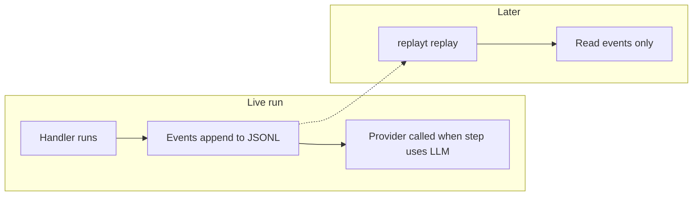

# Five-minute quickstart

This page gets you from install to **run -> inspect -> replay**. For a full tutorial with more workflows and patterns, use [`src/replayt_examples/README.md`](../src/replayt_examples/README.md).

## 1. Install

**End users (PyPI):**

```bash
python -m venv .venv && source .venv/bin/activate  # or Windows equivalent
pip install replayt
# pip install replayt[yaml]   # if you run .yaml / .yml workflow files
replayt doctor
```

**Quick smoke test** (if you use [uv](https://github.com/astral-sh/uv): no prior venv needed):

```bash
uv run --with replayt replayt try
```

**From a clone (contributors):**

```bash
pip install -e ".[dev]"
replayt doctor
```

**Logs and PII:** events land under `.replayt/runs/` by default. Pick **`--log-mode`** (CLI) or **`LogMode.*`** in Python if prompts may contain sensitive text. See [`RUN_LOG_SCHEMA.md`](RUN_LOG_SCHEMA.md) and [`PRODUCTION.md`](PRODUCTION.md).

## 2. Run a workflow (no API key needed)

The hello-world example is deterministic and does not call an LLM:

```bash
replayt run replayt_examples.e01_hello_world:wf \
  --inputs-json '{"customer_name":"Sam"}'
```

Note the printed **run ID** (UUID).

## 3. Inspect and replay

```bash
replayt inspect <run_id>
replayt replay <run_id>
```

Share a static HTML timeline (Tailwind via CDN):

```bash
replayt replay <run_id> --format html --out run.html
```

Or a self-contained report:

```bash
replayt report <run_id> --out report.html
```

## 4. What "replay" means

**`replayt replay`** walks the recorded JSONL timeline: states, transitions, LLM metadata, tool calls, and approvals, all **without** calling the provider again. It does **not** promise bitwise-identical LLM output if you run the same prompt again. Providers, temperature, and content can drift. For tests, use mocks or fixtures. For audits, use the **logged** history. See [`SCOPE.md`](SCOPE.md).



## 5. Annotated run log

Each run is an append-only **JSONL** file under `.replayt/runs/` (one line per event). Shapes are defined in [`RUN_LOG_SCHEMA.md`](RUN_LOG_SCHEMA.md). Below is a **trimmed excerpt** from `replayt_examples.e01_hello_world` (line breaks added for reading; on disk each event is one line).

```jsonl
{"ts": "2026-03-20T19:22:59.181461+00:00", "run_id": "...", "seq": 1, "type": "run_started", "payload": {"workflow_name": "hello_world_tutorial", "workflow_version": "1", "initial_state": "greet", "inputs": {"customer_name": "Sam"}}}
{"ts": "...", "run_id": "...", "seq": 2, "type": "state_entered", "payload": {"state": "greet"}}
{"ts": "...", "run_id": "...", "seq": 3, "type": "state_exited", "payload": {"state": "greet", "next_state": "done"}}
{"ts": "...", "run_id": "...", "seq": 4, "type": "transition", "payload": {"from_state": "greet", "to_state": "done", "reason": ""}}
{"ts": "...", "run_id": "...", "seq": 5, "type": "state_entered", "payload": {"state": "done"}}
{"ts": "...", "run_id": "...", "seq": 6, "type": "state_exited", "payload": {"state": "done", "next_state": null}}
{"ts": "...", "run_id": "...", "seq": 7, "type": "run_completed", "payload": {"final_state": "done", "status": "completed"}}
```

| Event | What it tells you |
|-------|-------------------|
| `run_started` | Which workflow/version ran, initial state, and inputs (may be redacted depending on log mode). |
| `state_entered` / `state_exited` | **When** each handler ran and **which** next state it returned. |
| `transition` | Explicit edge in the graph (good for diffs and audits). `reason` may be empty. |
| `next_state: null` on exit | Terminal state, no further steps. |
| `run_completed` | Final status (`completed`, `failed`, etc.). |

Workflows that call an LLM add `llm_request`, `llm_response`, and `structured_output` events; tool usage adds `tool_call` / `tool_result`; approvals add `approval_requested` / `approval_resolved`. All of those events go into the same file.

## 6. Where replayt fits

| Approach | What you get | Tradeoff |
|----------|----------|----------|
| **Plain Python** (`if`/`else`, your own prints) | Full flexibility | Ad hoc logs; hard to standardize replay, approvals, and CI. |
| **Agent / planner frameworks** | Fast demos | Hidden control flow; it is often hard to answer "what happened?" |
| **replayt** | Explicit FSM + **schema-shaped** outputs + **local JSONL** + CLI (`inspect`, `replay`, `report`) | You write states and transitions; not a distributed workflow engine. |

## 7. When a run fails (still inspectable)

Invalid inputs produce **exit code `1`** and a full event trail, including `run_failed` with validation or error detail, so you can debug them the same way as a happy path.

```bash
replayt run replayt_examples.e02_intake_normalization:wf --inputs-json '{"lead":{}}'
# note run_id from output, then:
replayt inspect <run_id>
replayt replay <run_id>
```

You should see `status=failed` and structured error payload on the failing state. See [`RUN_LOG_SCHEMA.md`](RUN_LOG_SCHEMA.md) for `run_failed` / `run_completed`.

## 8. Smallest structured LLM step (API key required)

After hello-world, this is the smallest pattern where model output is written into context (inside an existing `Workflow` with `OPENAI_API_KEY` set):

```python
from pydantic import BaseModel

class Label(BaseModel):
    label: str

@wf.step("classify")
def classify(ctx):
    out = ctx.llm.parse(
        Label,
        messages=[{"role": "user", "content": "One-word label for: refund request"}],
    )
    ctx.set("label", out.model_dump())
    return None
```

> **How it works:** When you call `ctx.llm.parse(...)`, replayt turns your Pydantic model into a JSON Schema and adds a `system` prompt that asks for JSON matching that schema (and uses native structured outputs when the provider supports them). You **do not** need to tell the model to "return JSON" or spell out schema fields in your own prompts. Keep `messages` focused on the task.

Run a full tutorial workflow with the same idea: **section 6** in [`src/replayt_examples/README.md`](../src/replayt_examples/README.md) (`replayt_examples.e06_sales_call_brief`).

## Next steps

- LLM-backed examples: [`src/replayt_examples/README.md`](../src/replayt_examples/README.md) (start at section 6+ or jump to **issue triage**).
- Composition patterns: [`EXAMPLES_PATTERNS.md`](EXAMPLES_PATTERNS.md).
- Recipes (LLM client, CI): [`RECIPES.md`](RECIPES.md).
- Production checklist: [`PRODUCTION.md`](PRODUCTION.md).
- Event schema reference: [`RUN_LOG_SCHEMA.md`](RUN_LOG_SCHEMA.md).
- Scope / non-goals in depth: [`SCOPE.md`](SCOPE.md).
- Vs other tools: [`COMPARISON.md`](COMPARISON.md).
- Runtime diagram source: [`architecture.mmd`](architecture.mmd).
